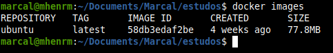
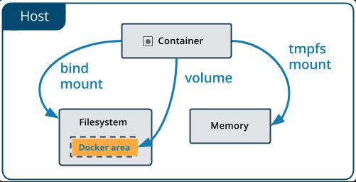
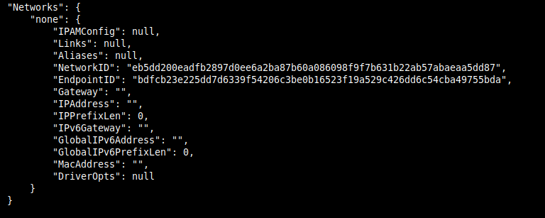

# **Estudo Docker**
Marçal Henrique Moreira  
Discente em Engenharia de Computação pelo IFMG - Campus Bambuí  
GitHub: <https://www.github.com/marcalhenrique>
--

----
Documento gerado a partir do estudo de Dockers.  
Este documento contém definições importantes, comandos utilizados e exemplos práticos.

# **1 - Introdução ao Docker**
Docker é uma plataforma de código aberto que permite a criação, gerenciamento e execução de aplicativos em ambientes isolados, chamados de containers. Estes containers são unidades de software que empacotam dependências e configurações necessárias para executar um aplicativo, bibliotecas, arquivos de configuração e código.  
O docker utiliza recursos do sistema operacional para implementar o isolamento dos containers. Especificamente, o Docker utiliza namespaces do kernel do Linux para fornecer um ambiente isolado para cada container.  
| Namespaces | Definição |
| -- | -- |
| PID | Isolamento dos processos rodando dentro do container |
| NET | Isolamento das interfaces de rede |
| IPC | Isolamento da comunicação entre processos e memória compartilhada |
| MNT | Isolamento do sistema de arquivos e pontos de montagem |
| UTS | Isolamento do Kernel. Age como se os containers fossem outro host |

Além disso, o Docker utiliza recursos de controle de recursos, como cgroups (grupos de controle), para limitar a quantidade de recursos que cada container pode consumir, como CPU, memória e largura de banda.  
Esses mecanismos de isolamento, fornece um ambiente seguro e isolado, garantindo que aplicativos não possam interferir em outros aplicativos ou no sistema local.

## **1.1 - Imagem**
Uma imagem é um pacote que contém tudo que é necessário para executar uma aplicação, incluindo código, bibliotecas, dependências, variáveis de ambiente e configurações.   
Cada imagem Docker é composta por uma ou mais camadas que são empilhadas para formar a imagem final. Cada camada representa uma mudança incremental na imagem, sendo uma adição, modificação ou uma remoção.  
Se buildadas em containers essas imagens sao imutáveis, tendo apenas sua camada de Leitura e Escrita (R/W) para ser modificadas.  
Camadas de R/W são camadas que permitem que o sistema de arquivos seja modificado.  

 <center>


 </center>

 # **2 - Iniciando com Docker**
 ## **2.1 - Iniciando um Container**
 A inicialização de um container é necessário ter uma imagem para build. Imagens estão disponíveis em: <https://hub.docker.com/>.
 Baixando uma imagem do DockerHub:
 ```
docker pull "Nome da Imagem"
----------------------------
docker pull ubuntu
 ```
Imagens baixadas podem ser visualizadas através do comando:
```
docker images
```

<center>



</center>

Com esse comando é possível descobrir o repositório, tag, ID da imagem, data de criação e tamanho.  
 
 Inicializar o container com uma imagem:

 ```
docker run "Nome da Imagem ou ID"
----------------------------
docker run "ubuntu"
 ```
Como nao foi especificado nenhum comando ou flag, o container foi criado e rodado. É possível ver a especificação com o comando:
```
docker ps -a
```
<center>


</center>

Com esse comando é possível descobrir o id do container, o comando utilizado, momento da criação, status, portas e o nome.  
Para definir um nome é necessário um comando na hora do build:
```
docker run --name "Nome do Container" "Nome ou ID da Imagem"
------------------------------------------------------------
docker run --name ubuntu_container ubuntu
```
o Container ainda está executando e finalizando. Para contornar isso é necessário um novo comando na hora do build.  
```
docker run -it --name "Nome do Container" "Nome ou ID da Imagem "Comando"
--------------------------------------------------
docker run -it --name ubuntu_container ubuntu bash

```
Se utilizado a flag -it é possível abrir um terminal iterativo do container, no exemplo um terminal bash.  

<center>


</center>

## **2.2 - Manipulando Containers**
Também é possível parar, reiniciar, pausar e matar o processo de um container:

```
docker stop "Nome ou ID do Container"
docker start "Nome ou ID do Container"
docker pause "Nome ou ID do Container"
docker kill "Nome ou ID do Container"
----------------------------------------
docker stop ubuntu_container
docker start ubuntu_container
docker pause ubuntu_container
docker kill ubuntu_container
```
## **2.3 - Excluindo Containers**

É possível também excluir um container com o seguinte comando:
```
docker rm "Nome ou ID do Container"
----------------------------------
docker rm ubuntu_container
```
Também é possível excluir uma lista de containers com o comando:
```
docker rm $(docker ps -aq)
```
Para exclusão de uma imagem funciona de forma semelhante:
```
docker rmi "Nome da Imagem"
---------------------------
docker rmi ubuntu
docker rmi $(docker images -q)
```

# **3 - Manipulando e Criando Imagens**
Com o Docker também é possível criar suas próprias imagens a partir do zero ou criar imagens a partir de imagens do Docker Hub.  
Para isso acontecer se é criado um arquivo chamado Dockerfile.

## **3.1 - Dockerfile**
Dockerfile é um arquivo de texto simples que contém uma lista de instruções que descreve como construir uma imagem Docker. Este arquivo é usado pelo Docker para automatizar processos de criação de imagens e garantir que as imagens sejam criadas de forma consistente e repetitiva.
Dockerfile contém uma série de instruções que descrevem como construir uma imagem entre elas:

| Instruções | Descrição |
| -- | -- |
| FROM | Especifica a imagem base para criação da nova imagem |
| RUN | Executa comando dentro do container para configuração ou execução tarefas de construção |
| COPY / ADD | Copia arquivo do host para dentro do container |
| ENV | Define variáveis de ambiente dentro do container |
| EXPOSE | Especifica portas de rede que o container deve escutar |
| CMD | Especifica o comando padrão que será executado quando o container for iniciado |

### **3.1.1 - Exemplo de Uso Bola na Urna**
Para exemplificar o uso do Dockerfile foi utilizado uma aplicação em python simples chamada bola na urna.  Essa aplicação consiste em uma caixa com bolas brancas, e uma moeda é jogada toda rodada, dependendo do lado da moeda uma bola é pintada de vermelho ou preto.  
Arquivo Dockerfile:
```Dockerfile
FROM python:3.9 # A partir do python 3.9
WORKDIR ./bola_na_urna # Diretório do projeto
COPY . . # Copia tudo do WORKDIR para dentro do container
CMD ["python", "bola_na_urna.py"] # Executa o arquivo em python

```
Com o arquivo Dockerfile criado basta criar a imagem:
```
docker build -t mhenrm/bola_na_urna_python3:1.0 .
```
<center>


</center>

Com a imagem criada é possível criar o container a partir dela no modo interativo:

```
docker run -it --name app_bola_na_urna mhenrm/bola_na_urna_python3:1.0
```

<center>


</center>

Depois da execução o container é fechado e vai para lista de containers criados.

###  **3.1.2 - Exemplo de Uso Hello World**
Como mencionado anteriormente é possível fazer o mapeamento de portas de aplicações com o host. Neste exemplo será exemplificado essa questão.  
O projeto Hello World é uma aplicação simples em node14 que mostra uma mensagem no navegador especificado na porta 8080.
Arquivo Dockerfile:
```Dockerfile
FROM node:14 # A partir do node 14
WORKDIR  ./hello_world # Diretório do projeto
ARG PORT=8080 # Define a porta padrão
EXPOSE $PORT # Mapeia a porta do container para a porta do host
ENV PORT=$PORT # Define a porta do container
COPY . . # Copia tudo do WORKDIR para dentro do container
RUN npm install # Instala as dependências do projeto
ENTRYPOINT npm start # Executa o arquivo em node
```
Com o arquivo Dockerfile criado basta criar a imagem:
```
docker build -t mhenrm/hello_world_node14:1.0 .
```
<center>


</center>

Com a imagem criada é possível criar o container a partir dela no modo background:
```
docker run -d --name app_hello_world -p 8080:8080 mhenrm/hello_world_node14:1.0
```

<center>


</center>

Utilizando a flag -p é possível mapear a porta do container para a porta do host.

## **3.2 - Upando Imagens**
O Docker Hub é um repositório de imagens Docker. É possível criar uma conta no Docker Hub e publicar suas imagens para que outras pessoas possam utilizar.
Para upar uma imagem no Docker Hub é necessário fazer o login no Docker Hub:
```
docker login
```
Após o login é possível upar a imagem:
```
docker push mhenrm/bola_na_urna_python3:1.0
```
<center>


</center>

É possível acessar a imagem upada pelo navegador acessando seu repositório no Docker Hub. Também é possível baixar a imagem e utilizar em outros projetos.

# **4 - Persistência de Dados**
Quando um container é excluído, qualquer dado não salvo em um volume ou em outro lugar persistente é perdido permanentemente.  
Existem várias maneiras de lidar com a persistência de dados em containers.
Para persistir dados existe três formas:
* **Bind Mounts**: Mapeia um diretório do host para dentro do container.
* **tmpfs mounts**: Sistema de arquivos virtual em memória. Só é possível utilizar em containers Linux. É um volume de armazenamento criado e gerenciado completamente na memória do host, em vez de um sistema de arquivos em disco.
* **Volumes**: Cria um diretório dentro do container que é mapeado para um diretório do host.

<center>



</center>

## **4.1 - Bind Mounts**
Bind Mounts é um recurso do DOcker que permite montar um diretório do host para dentro do container. Ao usar o bind mounts, arquivos e diretórios no diretório do host são acessíveis no container.
Para utilizar o bind mounts é necessário utilizar a flag -v ou --volume.
```
docker run -it -v "Caminho desejado no Host":"Caminho Desejado no Container" ubuntu bash
-----------------------------------------------------------------
docker run -it -v ./persistindo_dados:/home/persistindo_dados ubuntu bash 
```
Executando o comando é possível criar um arquivo dentro do container e acessar o mesmo arquivo no host.

<center>


</center>

É possível observar na imagem que a pasta especificada foi criada dentro do container. Utilizando o comando bash ``` touch teste_bind_mount.txt ``` foi criado um arquivo dentro do container e o mesmo arquivo foi criado no host.

<center>


</center>

Se navegado para a pasta do host é possível observar o arquivo criado no container.

<center>


</center>

## **4.2 - tmpfs mounts**
Quando um container Docker é executado com um volume tmpfs, ele pode escrever e ler arquivos normalmente dentro do volume. NO entanto, ao contrário de um volume de discos, os arquivos armazenados em volume tmpfs não persistem além da vida util do container. O tmpfs so é possível ser utilizado no Linux.  
Comando para utilizar o tmpfs mounts:
```
docker run -it --mount type=tmpfs,destination=/home/persistindo_dados ubuntu bash
```
<center>


</center>

O Tmpfs é bastante utilizado para armazenar dados temporários que não precisam ser persistidos.

## **4.3 - Volumes**
Volumes são os meios mais recomendados para persistir dados em containers. Os volumes são gerenciados pelo Docker e podem ser utilizados por vários containers.  
Comando para criar um volume:
```
docker volume create teste_volume
```
Se utilizado o comando ``` docker volume ls ``` é possível observar que o volume foi criado.  

<center>


</center>

Entretanto não é especificado onde o volume foi criado. Para saber onde o volume foi criado é necessário utilizar o comando ``` docker volume inspect teste_volume ```.

<center>


</center>

O volume foi criado no diretório de arquivos do Docker.  
Para utilizar o volume criado em um container é necessário utilizar seu nome como parâmetro da flag -v ou --volume.
```
docker run -it -v teste_volume:/home/persistindo_dados ubuntu bash
----------------------------------------------------------------
docker run -it --mount source=teste_volume,target=/home/persistindo_dados ubuntu bash
```
<center>


</center>

Se navegado para o diretório do volume é possível observar que o arquivo criado no container foi criado no host.

<center>


</center>

# **5 - Networks**
As Networks do DOcker permitem que os containers se comuniquem entre si de maneira eficiente e segura, além de permitir que se comuniquem com outros serviços em uma rede externa. Uma network é um ambiente isolado que permite que vários containers se comuniquem entre si e com o host em uma rede virtual, sem a necessidade de expor portas do host ao serviços externos.  
Existem três tipos de networks no Docker:
* **Bridge**: É a network padrão do Docker. É a network que é utilizada quando nenhum tipo de network é especificado.
* **Host**: A network host permite que os containers se comuniquem com o host e com outros containers sem a necessidade de portas expostas. A network host não é recomendada para ambientes de produção.
* **None**: A network none permite que os containers se comuniquem apenas com o host. A network none não é recomendada para ambientes de produção.

<center>


</center>

## **5.1 - Bridge**
Em termos de rede, uma rede bridge é um dispositivo Link Layer que encaminha o tráfego entre segmentos de rede.  
EM termos de Docker, uma rede bridge usa uma ponte de software que permite containers conectados a mesma rede de ponte a se comunicarem entre si, enquanto fornecem isolamento de rede de containers que não estão conectados a essa rede.  
Com o docker inspect é possível observar as informações da network de cada container.  
Se utilizado um container ja criado sem especificação de rede é possível observar que o container está conectado a network bridge.

<center>


</center>

### **5.1.1 - Criando uma Network Bridge**
Para criar uma network bridge é necessário utilizar a flag --driver ou -d para especificar o driver da rede.  
```
docker network create --driver bridge teste_bridge_rede
```
Para listar as networks criadas é necessário utilizar o comando ``` docker network ls ```.

<center>


</center>

### **5.1.2 - Conectando um Container a uma Network Bridge**
Para fazer a conexão de um container a uma network é utilizado o seguinte comando:
```
docker run -it --name ubuntu_teste --network teste_bridge_rede ubuntu bash
```
Utilizando o comando ``` docker inspect ``` é possível observar que o container foi conectado a network criada.

<center>


</center>

Se for criado um novo container na mesma rede é possível utilizar o comando ping do Linux para verificar a comunicação entre os containers.

```
docker run -d --name ubuntu_teste2 --network teste_bridge_rede ubuntu sleep 1d
```
<center>


</center>

Pontes definidas pelo usuário fornecem resolução automática de DNS entre containers. 

## **5.2 - Rede None**
A rede none é um tipo especial de rede que desativa completamente a comunicação de rede para um container. Quando é criado um container com a rede, este container nao terá acesso a nenhuma interface de rede. Isso significa que ele não pode se comunicar com outros containers, nem mesmo com o host ou a internet.  
Para utilizar a rede none basta utilizar a flag -network none.
```
docker run -d --network none ubuntu sleep 1d
```
Se usado o inspect é possível notar que o container não está conectado a nenhuma rede.

<center>



</center>

## **5.3 - Rede Host**
A rede Host é um tipo especial de rede em que um container compartilha a interface de rede do host. Portanto o container não é isolado da rede e pode facilmente acessar os serviços em execução no host ou em outras maquinas na mesma rede.
Para utilizar a rede host basta utilizar a flag -network host.
```
docker run -d --network host ubuntu sleep 1d
```
Se utilizado o projeto do exemplo anterior é possível acessa-lo pelo browser sem o mapeamento de portas.

```
docker run -d --network host mhenrm/hello_world_node14:1.0
```

<center>


</center>

# **6 - Docker Compose**
O Docker Compose é uma ferramenta para definir e executar aplicações Docker de vários containers. COm o Compose é possível definir vários serviços, cada um com sua própria imagem, volume, rede e configuração de ambiente. Essa configuração é feita em um arquivo YAML, que pode ser compartilhado e versionado com o código da aplicação.
Arquivo YAML é um formato de arquivo de configuração que permite a definição de dados estruturados. Este formato é muito utilizado para configuração de aplicações, pois permite a definição de dados estruturados de forma simples e legível.  
Como o Docker Compose é um assunto extenso, o exemplo de utilização sera feito em outro repositório.

# **7 - Tabela de Comandos e Flags**

Tabela de Comandos:

| Comandos | Definição |
| -- | -- |
| pull | Baixa uma imagem específica |
| images | Lista imagens baixadas ou criadas |
| run | Builda um container com a imagem
| ps | Lista containers |
| stop | Para um container |
| start | Reinicia um container |
| pause | Pausa um container |
| kill | Mata um container |
| rm | Remove um container |
| $ | Combinação de comandos |
| && | Vários comandos em linha |
| rmi | Remove uma imagem |
| build | Cria uma imagem a partir de um Dockerfile |
| login | Faz login no Docker Hub |
| push | Envia uma imagem para o Docker Hub |
| type | Tipo de volume |
| destination | Destino do volume |
| volume | Comando de volumes |
| create | Cria um volume |
| inspect | Inspeção de volumes |

Tabela de Flags:

| Flags | Definição |
| -- | -- |
| -a | Lista containers, imagens, networks em execução e já executadas|
| -q | Lista o ID dos containers |
| --name | Estabelece um nome ao container |
| -it | Modo iterativo |
| --force | Força um comando |
| -aq | Lista todos os ID's de containers |
| -d | Executa o container em background |
| -p | Mapeia uma porta do container para uma porta do host |
| -s | Mostra o tamanho do container |
| -v | Mapeia um volume do container para um volume do host |
| --mount | Mapeia um volume do container para um volume do host |
| --driver | Especifica o driver de rede |
| --network | Especifica a rede |

# **Conclusão**
O Docker é uma ferramenta útil para o desenvolvimento de aplicações, pois permite a virtualização e isolamento de ambientes de desenvolvimento, testes e produção. Utilizando suas ferramentas como Volumes, Networks, Dockerfile é possível criar ambientes de desenvolvimento e testes com alta perfomance e segurança.

# **Referências**
Documentação Docker: <https://docs.docker.com>  
Docker Cheat Sheet: <https://dockerlabs.collabnix.com/docker/cheatsheet/>


